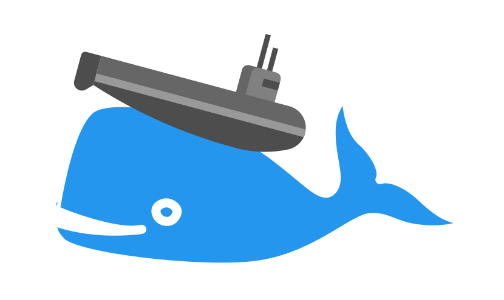

# Run Barotrauma Dedicated Server in Docker

*link:README.zh.adoc[>> 中文文档 <<]*

This repo is inspired by https://github.com/CM2Walki/steamcmd[CM2Walki] 
and https://github.com/gnoeley/barotrauma-dedicated-server-docker[gnoeley], with different approaches.

## Quick Start

*See https://hub.docker.com/r/yanwk/barotrauma-server[Docker Hub Page].*

## Flavors

### TL;DR

* If you just want to start a vanilla game in 5 minutes, use <<how-to-run-dockerful-flavor,`dockerful`>>.
* If you want a long running server with loads of mods, use `slim` and <<prepare-your-files,follow the steps>>.

### Details

*_Barotrauma Dedicated Server_* is basically a core subset of the game, without assets like images and sounds.
The game is program-data mixed, so is the Server, which brings more to consider when deploy in container-style.

Most importantly, is whether you need Modding or not.

For different scenario, we have three flavors: 

* <<how-to-run-slim-flavor,`slim`>> would run container in an "old fashioned", "non-dockerful", yet robust way.
** It only come with .NET runtime and SteamCMD (Official Steam Client CLI).
** It will download & install the game server on first start.
** It will update the game server (via SteamCMD) on every container restart.
** **It mounts the whole game server folder as a docker volume.**
*** So you can thoroughly modding your game (out of Mods folder). 
*** Restarting/Redeploying of container won't replace your files (But Be Careful Of Game Updates ;-)
** No environment variables. Just edit settings files.

* <<how-to-run-preload-flavor,`preload`>> is just `slim` with the server installed.
** It will update the game server (via SteamCMD) on every container start.
** Use it when you prefer `slim` but your server has a slow connection to Steam.
** If you're familiar with `docker build`, you could use this `Dockerfile.preload` to build your own image, preloading all your files into it.

* <<how-to-run-dockerful-flavor,`dockerful`>> is "containerized" at best.
** No SteamCMD included. Won't check update when start (so **starts fast** and **won't stuck at connecting Steam**).
** If the game updates, you'll need to run a new container with an up-to-date `yanwk/barotrauma-server:dockerful` image (this repo auto-builds every 3 hours).
** Certain files (including your **settings, mods, submarines and campaign saves**) are mounted to a docker volume for persistence.
** You can set Server Name, Server Password, Server Publicity and Admin's SteamID by setting ENV variables.
** **Will be a mess if Barotrauma makes a break change. So short-term game is preferred.**
** `Dockerfile.dockerful` also pre-load Mods files into image like `preload`. But will try copy(no overwrite) to persistence storage on every start. Could be messy if not clean it afterwards properly.

[[prepare-your-files]]
## Before start: Prepare your files

NOTE: If you choose `dockerful`, and have no mods/submarines/saves to upload, just jump to <<how-to-run-dockerful-flavor,Run dockerful>>.

1. Run Barotrauma on **your computer**, enable all mods you want.
2. Create a server, assume it's the dedicated server, set Server Name,
  Password, Public Visibility (not editable after server started). Then start the server.
  * You can leave game mode settings for later.
  * You don't need to actual start a round, settings will immediately write to file.
3. Quit game, open the game folder (e.g. Steam\steamapps\common\Barotrauma). Find these files:

.Main settings for server
 serversettings.xml

.All player-settings, we only need language and mods settings in it.
 config_player.xml

.Client permissions, mark you as the owner.
 Data/clientpermissions.xml

.Karma settings, don't need if not changed.
 Data/karmasettings.xml

Addtionally, you may want to copy:

.Submarine files
 Submarines/MY-SUPER-DUPER-POWERSUB.sub

.Mods folder
 Mods/

.Multiplayer campaign saves
----
# on Windows
"%localappdata%\Daedalic Entertainment GmbH\Barotrauma\Multiplayer"

# on macOS / Linux
"~/.local/share/Daedalic Entertainment GmbH/Barotrauma/Multiplayer"
----

Copy these files into a convenient place.

TIP: You could also https://ignis05.github.io/baro-save-editor/[conver a singleplayer campaign to multiplayer].

### Edit `config_player.xml`

We only need language setting (affect bots chat, outpost names, server log, etc):

 language="English"

and mods settings:

[source,xml]
----
  <contentpackages>
    <core
      name="Vanilla 0.9" />
    <regular>
      <package
        name="Holiday Oceanic"
        enabled="true" />
      <package
        name="Dayu" />
    </regular>
  </contentpackages>
----

You could in theory just replace server-side `config_player.xml` with your local one. Settings like graphics and sounds may not have effect on server. However it's better not doing that.

[[how-to-run-slim-flavor]]
## Guide: Run `slim`

### 1. Check your server environment

* Make sure you can access your container's volume, or file system.
** If not, check <<how-to-run-dockerful-flavor,`dockerful`>>.

### 2. Run the server once

.A. Using `docker run`
[source,sh]
----
docker run \
  --name barotrauma-server-slim \
  -p 27015:27015/udp \
  -p 27016:27016/udp \
  -v "baro-gamedir:/home/runner/Steam/steamapps/common/Barotrauma Dedicated Server" \
  yanwk/barotrauma-server:slim
----

.B. Using `docker compose`
[source,sh]
----
git clone https://github.com/YanWenKun/barotrauma-server-docker.git
docker compose -f docker-compose.slim.yml up
----

* If everything goes well, the log will show "Server started".
* For now, we can connect the server via IP address only.
** Make sure `27015/udp` & `27016/udp` is open.

### 3. Upload your files

Note, make sure no player is in server, or just stop the server.

Upload & replace the files mentioned above.
You can find them in *docker volume*.

If you need absolute path:

 "/home/runner/Steam/steamapps/common/Barotrauma Dedicated Server"

Multiplayer campaign save:

 "/home/runner/Steam/steamapps/common/Barotrauma Dedicated Server/Daedalic Entertainment GmbH/Barotrauma/Multiplayer"

### 4. Restart the server

Finally, restart the server in order for your changes to take effect.

.A. Using `docker restart`
 docker restart barotrauma-server-slim

.B. Using `docker compose`
 docker compose -f docker-compose.slim.yml restart

If you chekced "public server", you could see it on the list now.

Also, if you need to update the server, just restart it.

[[how-to-run-preload-flavor]]
## Guide: Run `preload`

Same as <<how-to-run-slim-flavor,`slim`>>, just replace the image tag:

.A. Using `docker run`
[source,sh]
----
docker run \
  --name barotrauma-server-preloaded \
  -p 27015:27015/udp \
  -p 27016:27016/udp \
  -v "baro-gamedir:/home/runner/Steam/steamapps/common/Barotrauma Dedicated Server" \
  yanwk/barotrauma-server:preload
----

.B. Using `docker compose`
[source,sh]
----
git clone https://github.com/YanWenKun/barotrauma-server-docker.git
docker compose --file docker-compose.dockerful.yml up
----

[[how-to-run-dockerful-flavor]]
## Guide: Run `dockerful`

### 1. Run server with ENV variables

.A. Using `docker run`
[source,sh]
----
docker run \
  --name barotrauma-server-dockerful \
  --env DEFAULT_SERVERNAME=AABBCC \
  --env DEFAULT_PASSWORD=112233 \
  --env DEFAULT_PUBLICITY=true \
  --env DEFAULT_LANGUAGE="English" \
  --env DEFAULT_OWNER_STEAMNAME="S0m3_b0dy" \
  --env DEFAULT_OWNER_STEAMID=5566778899 \
  -p 27015:27015/udp \
  -p 27016:27016/udp \
  -v "baro-data:/persistence" \
  yanwk/barotrauma-server:dockerful
----

NOTE: STEAMNAME and STEAMID require to use in combination.

NOTE: STEAMNAME is your Steam displayed name, NOT your account.

.B. Using `docker compose`
[source,sh]
----
git clone https://github.com/YanWenKun/barotrauma-server-docker.git
### Edit Compose file... ###
docker compose --file docker-compose.preload.yml up
----

The server is now good to go.
Steps below are optional.

### 2. Upload your files (optional)

Access your docker volume, there are four subfolders. Upload to them accordingly:

[cols=2]
|=== 
|Folder Name |Description

|configs
|Server Settings

|mods
|Same as Mods/ Folder

|multiplayer-saves
|Multiplayer Campaign Save

|submarines
|Your Submarine Files (*.sub)
|=== 

You may want to check <<prepare-your-files,file list>>.

[[restart-dockerful]]
### 3. Restart server (optional)

You need to restart the server for changes to take effect.

You can restart the container, or just create a new one:

[source,sh]
----
docker rm --force barotrauma-server-dockerful

docker run \
  --name barotrauma-server-dockerful \
  -p 27015:27015/udp \
  -p 27016:27016/udp \
  -v "baro-data:/persistence" \
  yanwk/barotrauma-server:dockerful
----

### 4. Update server settings

Just set ENV variables and start a new container:

[source,sh]
----
docker rm --force barotrauma-server-dockerful

docker run \
  --name barotrauma-server-dockerful \
  --env FORCE_SERVERNAME=BBCCAA \
  --env FORCE_PASSWORD=223344 \
  --env FORCE_PUBLICITY=true \
  --env FORCE_LANGUAGE="English" \
  --env FORCE_OWNER_STEAMNAME="S0m3_b0dy" \
  --env FORCE_OWNER_STEAMID=5566778899 \
  -p 27015:27015/udp \
  -p 27016:27016/udp \
  -v "baro-data:/persistence" \
  yanwk/barotrauma-server:dockerful
----

If you use Docker Compose, just edit the Compose file.

After you force-updated new settings, it's better to <<restart-dockerful,start a new container (again) without ENV variables>> to avoid accidental overwrite in future.

[[build-your-own]]
## Advanced: Build your own pre-loaded image

In this ultimate way, you build your own docker image pre-loaded with all settings, mods, submarines and saves.
This could be useful if you don't have access to your container's volume. But you still need to find a way to backup your saves.

NOTE: Update files in docker image won't affect volume. If you need to update mods on server frequently, you may want to edit Dockerfile.preload or Dockerfile.dockerful to meet your own needs (Focus on config_player.xml and Mods/ ).

1. Clone this repo

 git clone https://github.com/YanWenKun/barotrauma-server-docker.git

2. <<prepare-your-files,Prepare your files>>.

3. Replace the files in link:preloads/[preloads/]

4. Build & Run

A. Using `docker compose` (edit `docker-compose.preload.yml`)

 docker compose --file docker-compose.preload.yml up --build

B. Using `docker build` and `docker run`

[source,sh]
----
docker build . -f Dockerfile.preload -t my-baro-server
----

[source,sh]
----
docker run \
  --name my-barotrauma-server \
  -p 27015:27015/udp \
  -p 27016:27016/udp \
  -v "baro-gamedir:/home/runner/Steam/steamapps/common/Barotrauma Dedicated Server" \
  my-baro-server
----

### Testing: Run without server start

Since the Dockerfile here is using CMD as entry, you can easily override it, like:

[source,sh]
----
docker run \
  -it \
  --rm \
  --user root \
  -p 27015:27015/udp \
  -p 27016:27016/udp \
  -v "baro-gamedir:/home/runner/Steam/steamapps/common/Barotrauma Dedicated Server" \
  my-baro-server \
  /bin/bash
----

This will start a container in root bash without starting the server.

## Extra: An example Dockerfile for any game-server using SteamCMD

Check link:docs/Dockerfile.exmaple[Dockerfile.exmaple].

* It's a minimal Dockerfile.
* Try replacing `$STEAMAPPID`, `$GAMEDIR` and `DedicatedServerApp`. 
* Try add deps, runtimes.
* You can refer to link:Dockerfile.slim[Dockerfile.slim]
and link:Dockerfile.preload[Dockerfile.preload].

## Disclaimer

link:docs/submarine-whale.svg[This image] is derived from
https://www.maxpixel.net/Sperm-Whale-Valentines-Day-Wal-Heart-Blast-600387[here]
and
https://www.svgrepo.com/svg/193183/submarine[here]
with
https://creativecommons.org/publicdomain/zero/1.0/[CC0].

Source code under
link:LICENSE[MIT License].
